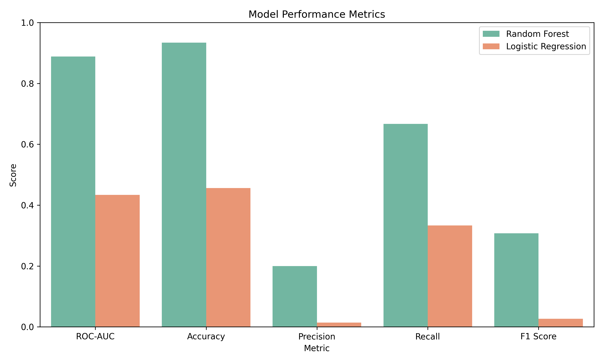
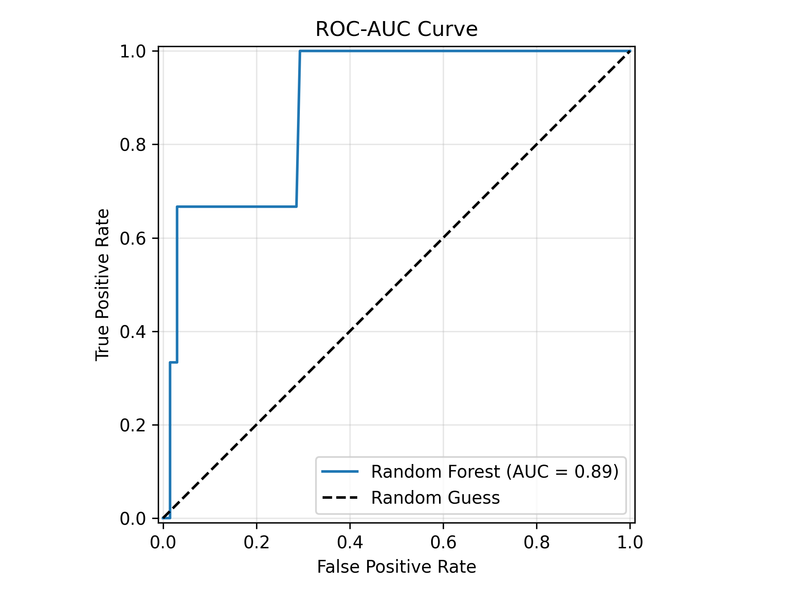
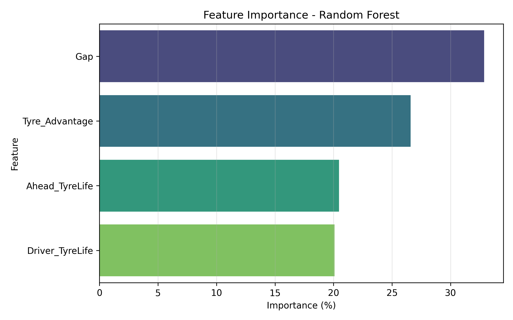
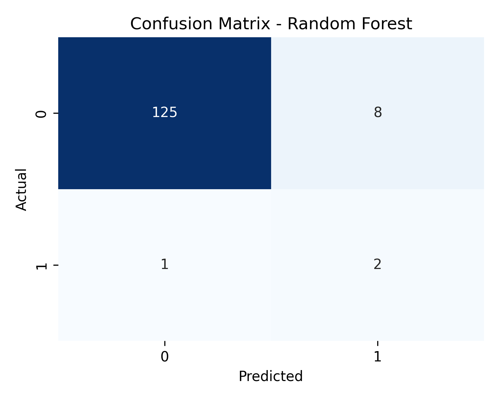

# F1 Undercut Prediction

Bu proje, Formula 1 yarış verilerinden undercut denemelerini çıkarıp bir pit-stop stratejisinin başarılı olup olmayacağını tahmin etmek için hazırlanmış uçtan uca bir makine öğrenmesi çalışmasıdır. Veri hattı FastF1 ile yarış turlarını işler, undercut senaryolarını etiketler, dengesiz sınıf problemini ADASYN ile dengeler ve strateji kararını açıklanabilir metriklerle raporlar.

## Proje Özeti

- **Problem:** Bir pilotun erken pit-stop ile önündeki aracı geçip geçemeyeceğini tahmin etmek.
- **Veri kapsamı:** 2022-2025 sezonlarından çıkarılmış undercut senaryoları.
- **Ham veri:** 684 satır, 8 sütun.
- **Model veri seti:** Eksik değerler atıldıktan sonra 677 satır.
- **Başarılı undercut sayısı:** 16 adet, yaklaşık %2.36 başarı oranı.
- **Dengesizlik çözümü:** Eğitim setinde ADASYN ile sentetik başarılı undercut örnekleri üretildi.
- **En iyi doğrulama modeli:** Random Forest.

## Proje Yapısı

```text
.
|-- data/
|   |-- raw/                  # Model veri seti
|   `-- sample/               # Örnek yarış kesiti
|-- outputs/
|   |-- figures/              # ROC, confusion matrix, feature importance grafikleri
|   |-- reports/              # Strateji analiz raporu
|   |-- results/              # Metrikler, özetler ve tablo çıktıları
|   `-- models/               # Yerel model dosyası, Git'e eklenmez
|-- src/
|   |-- data_loader.py
|   |-- train_model.py
|   |-- report_generator.py
|   |-- analyze_adasyn_data.py
|   |-- analyze_smote_data.py
|   |-- create_sample_race_snapshot.py
|   `-- paths.py
|-- requirements.txt
`-- README.md
```

## Kullanılan Özellikler

Model, undercut kararını dört değişken üzerinden değerlendirir:

| Özellik | Açıklama |
|---|---|
| `Gap` | Pit öncesi hedef araçla saniye farkı |
| `Driver_TyreLife` | Undercut deneyen pilotun lastik yaşı |
| `Ahead_TyreLife` | Öndeki aracın lastik yaşı |
| `Tyre_Advantage` | Öndeki aracın lastik yaşı eksi pilotun lastik yaşı |

## Model Sonuçları

Sonuçlar, `random_state=42` ile yapılan stratified %80 eğitim / %20 doğrulama ayrımı üzerinden hesaplandı. Doğrulama setinde yalnızca 3 başarılı undercut olduğu için precision/recall değerleri sınıf dengesizliğine duyarlıdır; bu yüzden ROC-AUC ile birlikte yorumlanmalıdır.

| Model | ROC-AUC | Accuracy | Precision | Recall | F1 Score |
|---|---:|---:|---:|---:|---:|
| Random Forest | 0.8885 | 0.9338 | 0.2000 | 0.6667 | 0.3077 |
| Logistic Regression | 0.4336 | 0.4559 | 0.0137 | 0.3333 | 0.0263 |

Random Forest doğrulama setinde daha yüksek ROC-AUC ve F1 skoru verdiği için ana model olarak kaydedilir.

## Görsel Çıktılar

### Model Performansı



### ROC-AUC Eğrisi



### Feature Importance



### Confusion Matrix



## Stratejik Bulgular

- Başarılı undercut oranı çok düşük olduğu için proje doğal olarak imbalanced classification problemidir.
- Başarılı undercut denemelerinde ortalama gap **3.353 sn**, başarısız denemelerde **4.851 sn** olarak ölçüldü.
- Random Forest için en önemli değişkenler `Gap`, `Tyre_Advantage`, `Ahead_TyreLife` ve `Driver_TyreLife` olarak sıralandı.
- Model, undercut kararını tek başına otomatik karar verici olarak değil, strateji ekibine sinyal üreten destek aracı olarak yorumlanmalıdır.

## Çıktı Dosyaları

- `outputs/results/model_metrics.csv`: Model karşılaştırma metrikleri.
- `outputs/results/feature_importance.csv`: Random Forest değişken önemleri.
- `outputs/results/classification_report_random_forest.txt`: Sınıf bazlı precision/recall/F1 raporu.
- `outputs/results/top_undercut_scenarios.csv`: Modelin en yüksek olasılık verdiği senaryolar.
- `outputs/results/real_success_examples.csv`: Gerçek başarılı undercut örnekleri.
- `outputs/reports/AI_Strategy_Report.md`: Otomatik strateji analiz raporu.
- `outputs/models/f1_undercut_model.pkl`: Eğitilen model dosyası. Bu dosya `.gitignore` kapsamındadır.

## Kurulum

```bash
pip install -r requirements.txt
```

İsteğe bağlı sanal ortam:

```bash
python -m venv .venv
.\.venv\Scripts\activate
pip install -r requirements.txt
```

## Çalıştırma

Mevcut veri setiyle modeli eğitmek ve metrik/grafik üretmek için:

```bash
python src/train_model.py
```

Strateji raporunu üretmek için:

```bash
python src/report_generator.py
```

Sentetik veri analizlerini yeniden üretmek için:

```bash
python src/analyze_adasyn_data.py
python src/analyze_smote_data.py
```

FastF1 üzerinden veri setini baştan üretmek için:

```bash
python src/data_loader.py
```

Bu adım FastF1 verilerini indirdiği için internet bağlantısı ve cache alanı gerektirir.

## Geliştirme Notları

Veri setindeki başarılı undercut sayısı az olduğu için sonuçlar tek split yerine ileride cross-validation ve zaman/sezon bazlı validation ile güçlendirilebilir. Canlı strateji kullanımı için pist, güvenlik aracı, pit-loss, lastik hamuru, hava durumu ve takım/pilot etkileri gibi ek değişkenler modele dahil edilmelidir.
